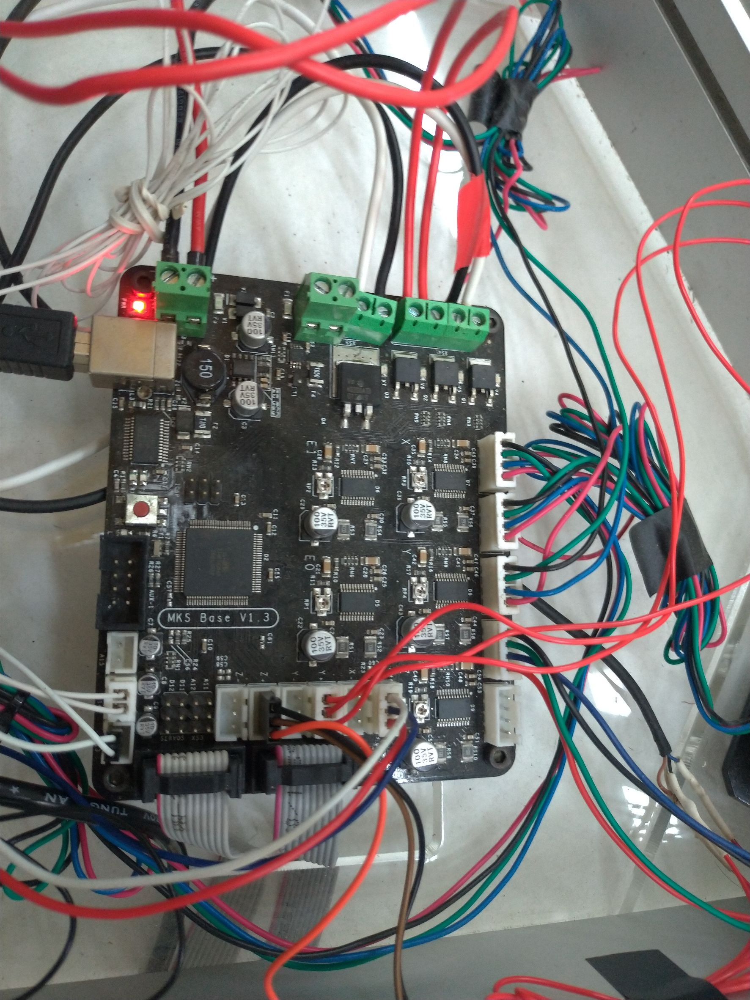
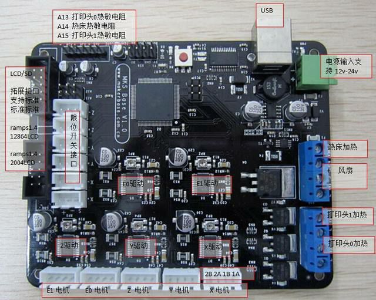
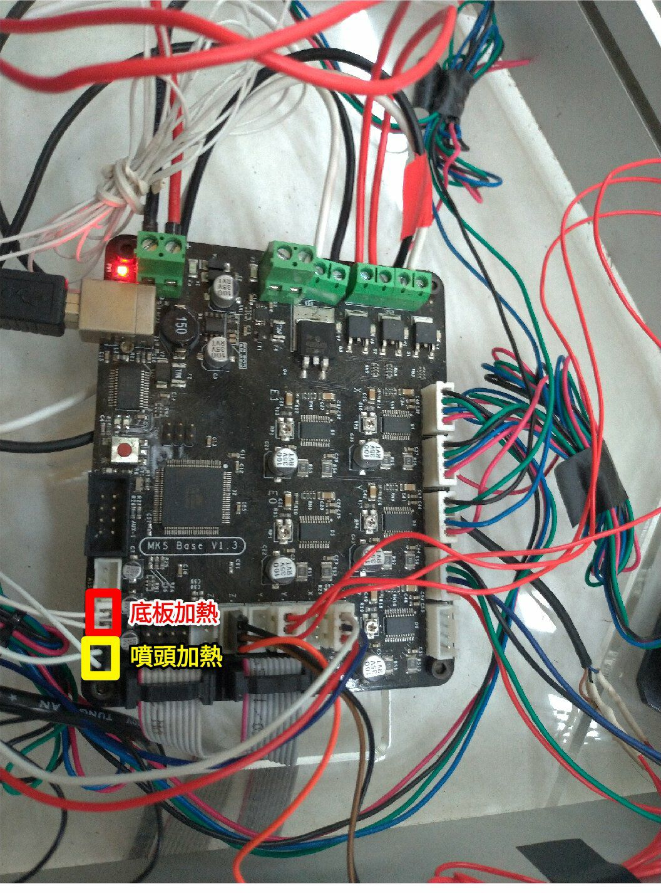
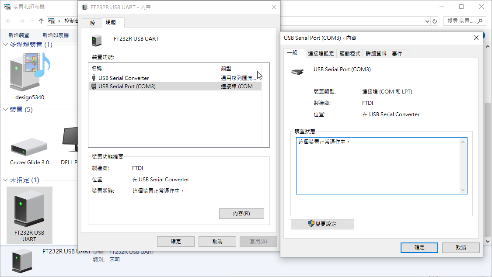
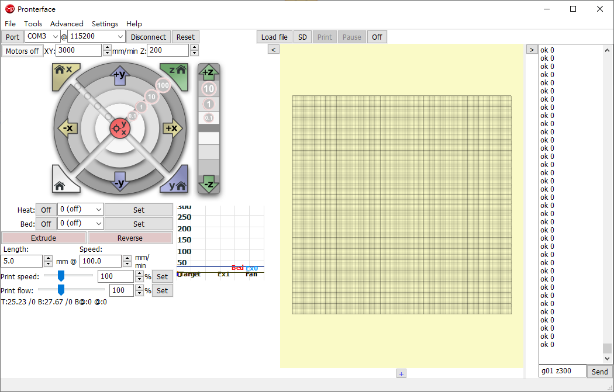
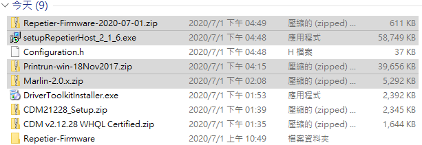

日誌
維修3D列印：噴嘴加熱和原點Z軸校正
<!-- PELICAN_END_SUMMARY -->

維修張元學長那屆當時組的3D印表機，目前發現兩個問題

1. 噴嘴加熱(~~無法加熱~~)  已解決
線路當時情況

**原始接線**

**各插槽功能**

**修正後(噴頭接A13，底板加熱A14)**
2. Z軸歸零後與底板還有一段距離
我們一開始先讓機器回歸原點，發現離下面的平台至少有14mm左右，然後稍微嘗試一下，發現印表機的介面沒有可以單獨控制Z軸的選項，只有L R B三個回歸原點和Home All(同Auto home的功能)，所以初步推測要校正Z軸原點的位置可能需要去修改firmware(韌體)，在網路上一番搜尋後，找到Marlin和Repetier都是可以裝在控制3D印表機的韌體。後來大三學長拿了之前學長的書面資料給我們看，發現當時是使用Repetier的firmware，其中"Configuration.h"是機台主要參數設定的檔，[repetier firmware]可以上傳舊的Configuration.h 或 config.json進行參數設定的更新。

[repetier firmware]: https://www.repetier.com/firmware/v091/

連接3D印表機控制板的USB線到電腦後就出現COM3

**將操控板連到電腦當時讀到的位置是COM3**

**Pronterface 介面**

Pronterface 可以透過介面上按鈕或是G-cord控制3D印表機噴頭位置，選到正確的Port按connect就可以連上。

File link

**當時下載的檔案**

[https://www.repetier.com/firmware/v100/config.php?a=downloadAll](https://www.repetier.com/firmware/v100/config.php?a=downloadAll)

[http://download.repetier.com/files/host/win/setupRepetierHost_2_1_6.exe](http://download.repetier.com/files/host/win/setupRepetierHost_2_1_6.exe)

[http://kliment.kapsi.fi/printrun/Printrun-win-18Nov2017.zip](http://kliment.kapsi.fi/printrun/Printrun-win-18Nov2017.zip)

Website URL

[https://forum.duet3d.com/topic/3800/resetting-the-origin-of-a-delta](https://forum.duet3d.com/topic/3800/resetting-the-origin-of-a-delta)

[https://www.pronterface.com/](https://www.pronterface.com/)